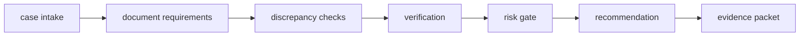

# Architecture

## Case state
Stores required documents, received evidence, discrepancies, verification status, risk, and audit events.

## Recommendation gate
Prioritizes high-risk conflict escalation, missing-evidence requests, verification, and only then ACT.

## Evidence packet
Produces a structured snapshot suitable for a human reviewer or downstream UI.

## Principle
Operational workflow should expose uncertainty and missing evidence as first-class states instead of hiding them behind an AI answer.
